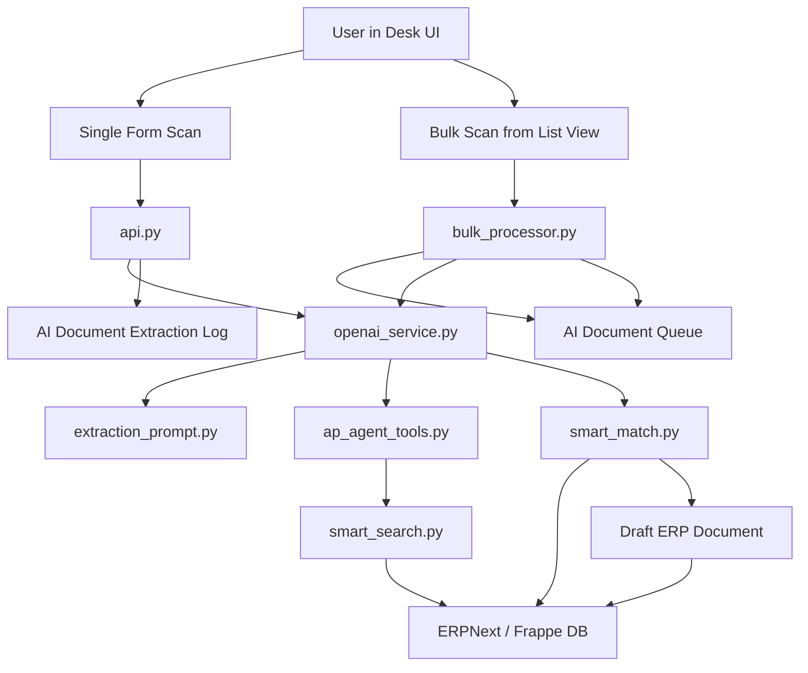

# Possibleworks AI Document Processing Architecture

This document is the current end-to-end architecture guide for the AI-powered document processing system inside the `possibleworks` Frappe app.

It is written as a practical developer reference. The goal is to explain:

- why this feature exists
- how the two user approaches work
- how the OpenAI agent is wired
- how search, matching, normalization, and draft creation work
- which files matter most
- where the system is intentionally generic and where it still carries older AP naming

## 1. Background and Current Reality

This feature started as an AP invoice automation workflow and grew into a broader AI document processor.

It now supports:

- multiple supplier-side doctypes
- selected customer-side doctypes
- Payment Entry extraction
- single-form interactive flow and asynchronous bulk processing

Important naming reality:

- the canonical doctypes are `AI Document Processor Settings`, `AI Document Queue`, and `AI Document Extraction Log`
- the Python package/folder is still named `ap_invoice_processing`
- some JS/CSS files also still carry the `ap_invoice` naming

The architecture is broader than AP, but some code paths retain the old naming for compatibility and migration safety.

## 2. Current Scope

### Supported rollout doctypes

- `Purchase Invoice`
- `Purchase Receipt`
- `Supplier Quotation`
- `Payment Entry`
- `Sales Order`
- `Quotation`
- `Delivery Note`

### Not currently in scope

- `Expense Claim` is intentionally excluded
- this is not yet a universal OCR engine for every ERPNext doctype

## 3. What This System Solves

At a business level, three hard problems are solved together:

1. document reading
2. ERP master matching
3. safe draft creation

Reading a PDF alone is not enough. A useful ERP workflow needs the system to answer:

- who is the real party on this document
- which ERP item should each line map to
- which tax structure is actually valid
- whether the document is a duplicate
- whether document math is consistent
- which draft doctype should be created

The architecture is intentionally split into layers:

- AI extraction layer
- tool-driven ERP lookup layer
- deterministic post-processing layer
- draft document creation layer
- UI and queue orchestration layer

## 4. Architecture Summary

The system converts uploaded files into structured AI extraction, enriches and corrects that extraction with ERP-aware search and deterministic business rules, and then either fills a live form or creates draft documents asynchronously in bulk.

## 5. High-Level Component Map



## 6. The Two User Approaches

### Approach A: Auto Filling Form

The synchronous, interactive path.

User experience:

- user opens a draft document form
- clicks `AI Smart Scan`
- uploads a PDF or image
- AI extracts and matches data
- the form is filled immediately

Best when the user is working on one document and wants to review before saving.

### Approach B: Bulk Upload With Queue

The asynchronous batch-processing path.

User experience:

- user opens a supported list view
- clicks `AI Bulk Scan`
- uploads many files or a ZIP
- a queue record is created
- a background worker processes each file
- draft documents are created automatically
- progress and failures are visible on the queue record

Best when many documents arrive together and throughput matters more than per-document review.

## 7. User-Facing Entry Points

### 7.1 Single-form entry points

Registered in `hooks.py` through `doctype_js`.

Current form scripts:

- `public/js/ap_invoice/purchase_invoice_form.js`
- `public/js/ap_invoice/ai_document_form.js`

Behavior:

- `Purchase Invoice` gets a richer review dialog before filling fields
- other rollout doctypes use the generic apply-to-form flow

### 7.2 Bulk entry points

Registered in `hooks.py` through `doctype_list_js`.

Current list script:

- `public/js/ap_invoice/purchase_invoice_list.js`

Behavior:

- this single script is registered for all rollout doctypes in `hooks.py`
- adds two buttons on each supported list view:
  - `🤖 AI Bulk Scan`: upload multiple files or a single ZIP and enqueue one batch
  - `🤖 AI Processing Queue`: opens `AI Document Queue` list
- passes the current list's doctype as `target_doctype` to `bulk_processor.enqueue_bulk_processing`
- de-duplicates file URLs while preserving upload order (done server-side)
- Purchase Invoice-only UX:
  - shows `AI Draft Created` status pill when `remarks` contains the AI bulk upload note
  - this pill is driven by a note appended during draft creation in `bulk_processor._append_ai_note`

### 7.3 Queue monitoring

Current queue scripts:

- `ap_invoice_processing/doctype/ap_invoice_queue/ap_invoice_queue.js`
- `ap_invoice_processing/doctype/ap_invoice_queue/ap_invoice_queue_list.js`

Behavior:

- queue form renders a live dashboard from `processing_log` (full-width HTML section)
- queue form auto-reloads every 3 seconds while batch is active
- queue list view shows batch-level status indicators and includes `Target DocType` as a column

## 8. Detailed Flow: Auto Filling Form

### 8.1 Purchase Invoice flow

`purchase_invoice_form.js` does the following:

1. Shows `AI Smart Scan` only for draft Purchase Invoices without supplier set.
2. Opens a dialog with an `Attach` field using `bypass_document_check`.
3. Calls `possibleworks.ap_invoice_processing.api.process_single_invoice`.
4. Receives:
   - `parsed_data`
   - `match_result`
   - `log_id`
5. Shows a review dialog with extracted header values, item table, tax table, warnings, success messages, and duplicate detection.
6. On confirmation, fills the form and optionally attaches the file after save.
7. Items are filled using direct `row.item_code = value` assignment (NOT `frappe.model.set_value`) so ERPNext's `get_item_details` AJAX is never triggered and cannot overwrite the AI-extracted rate/qty/amount with item master defaults.
8. UOM is fetched in a single batch `frappe.client.get_list` call after all rows are added, avoiding the full `get_item_details` AJAX.
9. Tax template and payment terms are set inside a `setTimeout(500ms)` callback (after supplier-defaults AJAX settles) so AI values override whatever ERPNext's `get_party_details` AJAX wrote.
10. A double-rAF restore re-asserts AI values as a final safety net against synchronous form-trigger overwrites.
11. `__pw_ai_unmatched_item` flag on each row drives a red warning badge for items that could not be matched to an ERPNext item code.

### 8.2 Generic doctype flow

`ai_document_form.js` is used for:

- `Purchase Receipt`
- `Supplier Quotation`
- `Payment Entry`
- `Sales Order`
- `Quotation`
- `Delivery Note`

This flow is simpler:

1. user uploads a file
2. backend extracts and matches
3. JS applies values directly to the current form
4. line items and taxes are filled when child tables exist
5. notes/warnings are shown via `msgprint`

### 8.3 What the single API returns

`api.py` is intentionally thin. It performs:

1. file lookup from `file_url`
2. AI extraction via `openai_service.extract_data_from_file`
3. post-processing via `smart_match.perform_smart_match`
4. audit log creation in `AI Document Extraction Log`
5. response back to the frontend

## 9. Detailed Flow: Bulk Upload With Queue

### 9.1 Queue creation

`bulk_processor.enqueue_bulk_processing` is the public entry point.

It performs:

1. validates target doctype against rollout scope
2. normalizes uploaded file URLs
3. optionally extracts files from ZIP upload
4. de-duplicates file URLs while preserving order
5. creates one `AI Document Queue` record for the whole batch
6. stores batch id, file count, file URLs JSON, target doctype, and triggering user
7. enqueues one background job through `frappe.enqueue` with `queue="long"` and `timeout=1800`

Important design choice:

- one queue record represents one batch
- the worker receives the file list directly as payload
- worker processing does not depend only on queue field schema

### 9.2 Worker execution

`bulk_processor.process_batch` runs in the background queue.

Atomic state transition at the start:

- `frappe.db.get_value` is used to read the current status before any work begins
- if status is not `Queued`, the worker exits silently (prevents duplicate processing)
- `queue_doc.db_set("status", "Processing")` followed by `frappe.db.commit()` transitions the record atomically

For each file the worker performs:

1. resolve the actual `File` document
2. run AI extraction
3. run smart matching and normalization
4. create a draft document of the target doctype
5. attach the source file to the created document
6. append a structured per-file entry into `processing_log`
7. commit progress after each file

Important resilience behavior:

- one failed file does not kill the full batch
- each failed file rolls back its own transaction
- the batch continues with remaining files

### 9.3 Queue states

Batch-level states:

- `Queued`
- `Processing`
- `Done`
- `Partially Done`
- `Failed`

Per-file states in `processing_log`:

- `Processing`
- `AI Draft Created`
- `Flagged`
- `Failed`

### 9.4 Queue monitoring UX

`AI Document Queue` is the operational monitoring surface:

- the form script polls while active
- `processing_log` JSON is rendered as an HTML dashboard
- each file row shows: status, error, warnings, processing time, link to created document

## 10. Extraction Pipeline

### 10.1 File acquisition

Implemented in `openai_service.py`.

The service receives a Frappe `File` document name, then:

1. loads binary file content with `get_file`
2. validates extension against settings
3. validates file size against settings

### 10.2 PDF and image preprocessing

If file is a PDF:

- `pdf2image.convert_from_bytes` renders pages to JPEG images at 150 DPI
- capped at 30 pages maximum
- each image is base64 encoded
- two-stage attempt: first with `last_page=30` (requires `pdfinfo` for page-count validation); if `PDFPageCountError` is raised (common with government/portal PDFs such as Kaveri, MCA whose `pdfinfo` fails even though `pdftoppm` renders fine), retries without `last_page`, then slices result to 30

If file is already an image:

- the image is base64 encoded directly

The vision model always receives image inputs, even for PDFs.

### 10.3 Prompt and schema construction

`extraction_prompt.py` builds the extraction prompt. The prompt is target-doctype-aware and includes:

- core extraction instructions
- data consistency rules (quantity × rate = amount)
- tax rules (no phantom taxes, prefer CGST+SGST over IGST mixing, etc.)
- hierarchy rules (no double-counting parent and child lines)
- party-identification rules (supplier is the issuer, not the bill-to company)
- a strict JSON schema for the target doctype

The prompt also includes an explicit step-by-step workflow for the target doctype. For Purchase Invoice:

1. `get_company_context`
2. `find_supplier` → `get_supplier_defaults`
3. for each line item: `find_item` → if no match, MANDATORY `list_all_items` with semantic reasoning
4. `check_duplicate_invoice`
5. tax template or account resolution
6. output final JSON

In addition, `openai_service._build_item_groups_section()` appends a live catalog of all non-empty Item Groups to the system prompt at extraction time. Each group shows its name and item count. This means the model already knows which groups exist before any tool call, and can immediately call `list_all_items(item_group='...')` without a separate lookup step.

### 10.4 Agent message structure

The service builds OpenAI chat messages with:

- one system message containing the prompt, JSON schema, step-by-step workflow, and live Item Group catalog
- one user message containing a textual instruction plus one or more `image_url` objects with base64 data URLs

### 10.5 Agent loop execution

`openai_service._run_agent_loop` runs a tool-calling loop:

- max retries: `3`
- max agent steps per extraction: `15`
- `tool_choice="auto"`, `response_format={"type": "json_object"}` on every call

The loop behavior is:

1. call model with tools enabled
2. if tool calls exist:
   - execute tool locally via `execute_tool`
   - log tool name, arguments, and result to `tool_calls_log`
   - append tool result to the conversation
   - continue loop
3. if no tool calls and JSON content exists:
   - parse JSON
   - validate required fields against schema
   - return result dict

Token tracking accumulates across every agent step:

- `total_input_tokens`: sum of all `prompt_tokens` across steps
- `total_output_tokens`: sum of all `completion_tokens` across steps
- `total_cached_tokens`: sum of cached token portions (billed at ~50% rate)
- `estimated_cost_usd`: computed from `_compute_cost_usd()` using per-model pricing table

The per-model pricing table in `_MODEL_PRICING` covers `gpt-4o`, `gpt-4o-mini`, `gpt-4.1`, `gpt-4.1-mini`, and dated snapshot variants. Unknown models fall back to `gpt-4o` rates.

### 10.6 What `extract_data_from_file` returns

Returned to callers (`api.py`, `bulk_processor.py`):

- `parsed`: the model JSON parsed into a Python dict
- `raw_response`: the raw JSON string produced by the model
- `page_count`: number of PDF pages rendered (or `1` for native images)
- `model_used`: the OpenAI model name used
- `agent_steps`: number of loop iterations before final output
- `input_tokens`: total prompt tokens across all steps
- `output_tokens`: total completion tokens across all steps
- `cached_tokens`: total cached prompt tokens across all steps
- `total_tokens`: `input_tokens + output_tokens`
- `estimated_cost_usd`: float cost estimate in USD
- `tool_calls_log`: ordered list of every tool called, with arguments and results

## 11. Agent Tools

The tool catalog lives in `ap_agent_tools.py`.

These tools are the only structured actions the model can use. The model never queries ERPNext directly — it only sees tool results.

### 11.1 Context tool

| Tool | What it does |
| --- | --- |
| `get_company_context` | Returns default company name, abbreviation, currency, and country. Must be called first. |

### 11.2 Supplier-side master tools

| Tool | What it does |
| --- | --- |
| `find_supplier` | Searches ERPNext Supplier by name or GSTIN. Returns top 3 candidates with similarity scores. GSTIN exact match takes priority. |
| `get_supplier_defaults` | Returns explicitly configured supplier defaults: payment terms, currency, and accounts. Does not leak company-level tax templates. |
| `find_item` | History-first item search. ALWAYS pass `supplier=<id>` (or `customer=<id>`) — items this party has purchased/sold before appear first regardless of text similarity score, letting the AI make semantic bridges (e.g. "AMC" → "Annual Maintenance Contract"). Score = 60% text similarity + 40% frequency signal. Top-5 history items always included. Falls back to catalog fuzzy search for remaining slots. Returns `{"matches": [...]}` when found. Returns `{"matches": [], "directive": "..."}` when nothing matches — directive explicitly instructs the model to call `list_all_items` next as a mandatory fallback. |
| `list_all_items` | Returns active ERPNext items. `item_group` is optional — pass it to scope the result to a specific category (groups are listed in the system prompt), or omit it to get all items. Uses semantic matching: 'AMC' maps to 'Annual Maintenance Contract', 'rent' maps to 'lease', 'repair' maps to 'maintenance'. |
| `find_purchase_order` | Finds open Purchase Orders by PO number or supplier. Returns line items with billed status. |
| `check_duplicate_invoice` | Checks whether a Purchase Invoice with same bill number and supplier already exists (submitted or draft). |
| `find_purchase_receipt` | Finds submitted/unbilled Purchase Receipts linked to a PO or supplier. |

### 11.3 Tax and accounting tools

| Tool | What it does |
| --- | --- |
| `find_tax_template` | History-first tax template search. ALWAYS pass `supplier=`/`customer=`. Templates this party previously used appear first with `source=supplier_history` and `times_used` count. Falls back to catalog search (company-scoped first, then global). Returns template rows with account heads and rates. |
| `find_tax_account` | History-first GL account search for a specific tax type and rate. ALWAYS pass `supplier=`/`customer=`. Accounts this party previously used for this exact tax type (CGST/SGST/IGST/TDS/Cess) appear first with `source=supplier_history`, `times_used`, and `historical_rate`. Falls back to catalog search with `account_type="Tax"` filter. |
| `find_expense_account` | Finds expense head accounts for purchase line items. |
| `find_cost_center` | Finds cost centers by name or keyword. |
| `find_warehouse` | Finds warehouses for stock-related flows. |
| `find_project` | Finds active projects. |
| `find_payment_terms` | Finds payment terms templates by label or keyword. |

### 11.4 Customer-side tools

| Tool | What it does |
| --- | --- |
| `find_customer` | Searches ERPNext Customer by name or GSTIN. Returns top 3 candidates. |
| `get_customer_defaults` | Returns explicitly configured customer defaults: price list, payment terms, territory, accounts. |
| `find_sales_order` | Finds open Sales Orders by number or customer. |
| `find_delivery_note` | Finds Delivery Notes linked to Sales Orders or Customer. |

### 11.5 Payment tools

| Tool | What it does |
| --- | --- |
| `find_mode_of_payment` | Finds a valid Mode of Payment and its linked default account. |
| `find_bank_account` | Finds bank or cash accounts for payment flows. |

### 11.6 Tool execution mechanics

`execute_tool` in `ap_agent_tools.py` is the runtime dispatcher:

- receives tool name plus JSON arguments
- calls the corresponding Python helper
- returns JSON string back to the model
- exceptions are caught and returned as `{"error": "..."}` so the loop continues

### 11.7 Item tool search parameters

`find_item` internals:

- accepts `supplier` or `customer` param (pass whichever party was matched)
- party history pass: loads candidates from `business_memory.get_party_history_item_candidates`, scores as `text_similarity*0.60 + frequency_signal*0.40`, always includes top-5 regardless of score, with `confidence: "history_only"` for low-text-similarity matches
- catalog search: `smart_search` over fields `item_name`, `item_code`, `description`; filters `disabled = 0`; similarity threshold `SIMILARITY_THRESHOLD_ITEM` (`0.50`); post-filter keeps `exact|high|medium` or `similarity_score >= 0.55`
- merge: history first, catalog fills remaining slots without duplicates (combined limit: 5)
- when no results pass the filter, returns `{"matches": [], "directive": "<mandatory fallback instruction>"}` instead of an empty list
- history results include: `source: "supplier_history"`, `times_used`, `item_code`, `item_name`, `texts[]`

`list_all_items` internals:

- filters: `disabled = 0`
- if `item_group` is provided: filters by `item_group LIKE '%<group>%'`
- if `item_group` is omitted: returns all active items
- limit: 200 items ordered by `item_name asc`
- returns `item_code`, `item_name`, `item_group`, `uom`, and truncated `description`

## 12. How Searching Happens

Searching happens in two layers.

### 12.1 Live agent-time search

While extraction is happening, the model calls tools such as `find_supplier`, `find_item`, `find_tax_account`. These tools rely on `smart_search.py`.

### 12.2 `smart_search.py`

`smart_search.py` is the generic fuzzy-search engine used by tool helpers and also by server-side fallback matching in `smart_match.py`.

Current strategy:

1. exact match — SQL equality, returns immediately with confidence `exact`
2. case-insensitive `LIKE` — scores all candidates locally, returns with confidence `high`
3. legal-suffix stripping — removes `ltd`, `pvt`, `service`, `group`, etc., runs `LIKE` again, confidence `high`
4. progressive word reduction — drops last word repeatedly, searches shorter phrase, confidence `medium`
5. broad fuzzy comparison — loads up to 100 candidates from SQL, scores each locally, keeps above threshold, confidence `fuzzy`

This means fuzzy search is never used first. Cheaper, more deterministic forms are tried before going broad.

### 12.2.1 Search thresholds

- party search threshold: `0.55`
- item search threshold: `0.50`
- default search threshold: `0.55`

These are baseline gates. Later stages apply stricter acceptance rules before a final match is trusted.

### 12.2.2 Core string-normalization algorithm

1. lowercase and strip punctuation to plain alphanumeric words
2. tokenize on whitespace
3. apply light suffix reduction for item-like words
4. compare direct string similarity
5. compare token overlap
6. compare sorted stem-signatures
7. compare character n-gram overlap

Item-similarity blend:

- base normalized string ratio: `40%`
- sorted stem ratio: `25%`
- token overlap ratio: `20%`
- character trigram overlap: `15%`

Final score is the max of: base ratio, token overlap, sorted stem ratio, character overlap, blended score, subset-match shortcut.

The subset-match shortcut handles cases where one text is a reduced form of the other after normalization.

### 12.2.3 Meaningful-token extraction

The item fallback layer extracts meaningful tokens by:

- ignoring tokens shorter than 4 characters **unless** the token is ALL-CAPS in the original string and ≥ 2 chars (e.g. `AMC`, `AC`, `IT` are preserved — short uppercase abbreviations are meaningful)
- ignoring numeric-only tokens
- ignoring very generic stopwords
- keeping unique tokens in original order

This is a generic text-cleaning layer, not a business synonym dictionary.

### 12.3 Why there is a second match layer after the agent

The model may still be inconsistent even after calling tools. So the system does not trust model output blindly. After extraction, `smart_match.py` runs deterministic business logic on top of the AI result.

## 13. How Matching and Normalization Happens

`smart_match.py` is the main reconciliation layer. This is where the architecture becomes ERP-safe instead of only AI-smart.

### 13.1 Party matching

Party matching behavior includes:

- supplier/customer fallback fuzzy search
- GST-based lookup
- self-company detection so bill-to company is not mistaken as supplier
- duplicate invoice detection for Purchase Invoices

### 13.1.1 Party candidate rescoring algorithm

For supplier/customer fallback search, the system applies a second score using:

1. base fuzzy similarity from `smart_search.py`
2. history boost from the candidate party's previous items

The history boost:

- takes up to 3 extracted line descriptions from the current document
- compares them with up to 20 historical item texts for the candidate party
- computes average best-line similarity
- adds a small dominance bonus based on how strong that party history is

The final boost is capped at `0.18`, with an additional small dominance allowance up to `0.04`.

### 13.2 Item matching

Item matching works in several passes:

1. accept model-provided `item_code_matched` only as a provisional suggestion
2. revalidate AI-selected item codes against ERP item master evidence
3. clear or override weak AI-selected matches when supplier/reference history strongly disagrees
4. local item-catalog re-match using ERP data
5. linked document history remap
6. supplier/customer history remap from previous approved trade documents
7. category-first semantic routing via Item Groups (embeddings + weighted scoring)
8. meaningful-token fallback over the item catalog for still-unmatched rows
9. small-amount dominant-item fallback for tiny supporting lines
10. leave the row as raw description if no strong evidence exists

### 13.2.1 Business memory candidate-building algorithm

`business_memory.py` builds historical item candidates from past documents.

For suppliers, source priority:

1. `Purchase Invoice`
2. `Purchase Order`
3. `Purchase Receipt`
4. `Supplier Quotation`

For customers, source priority:

1. `Sales Invoice`
2. `Sales Order`
3. `Delivery Note`
4. `Quotation`

Each historical row gets a weight from:

- base source weight
- `+0.35` if the parent document is submitted
- `-0.08` if the parent is draft
- recency bonus starting near `0.12` and gradually dropping with rank

Source base weights:

- `Purchase Invoice`: `1.00`
- `Purchase Order`: `0.88`
- `Purchase Receipt`: `0.82`
- `Supplier Quotation`: `0.72`
- `Sales Invoice`: `1.00`
- `Sales Order`: `0.92`
- `Delivery Note`: `0.84`
- `Quotation`: `0.72`

Rows are then aggregated by `item_code` into a candidate profile containing: count, weighted count, representative text variants, top expense account, top cost center, HSN/SAC frequency.

`business_memory.get_party_tax_history(party_type, party_name, company)` is the companion function for tax history:

- queries last 60 Purchase Invoices (or Sales Invoices for customers) for the party
- aggregates `taxes_and_charges` template usage by frequency
- queries child tax rows (`Purchase Taxes and Charges` / `Sales Taxes and Charges`) and classifies each by type using `_classify_tax_type`: IGST → CGST → SGST → TDS → TCS → Cess → Other (checked in that order, most-specific first)
- returns: `{"templates": [{template_name, count}], "tax_accounts": {"CGST": [{account, rate, count}], "SGST": [...], ...}}`
- used by `_find_tax_template` and `_find_tax_account` in `ap_agent_tools.py` to surface previously-used tax data at the top of results
- all results are request-scoped cached via `frappe.local._ai_document_business_memory_cache`

### 13.2.2 Historical item scoring formula

When matching an extracted line against historical candidates:

1. best text similarity against candidate texts
2. usage boost: `min(0.10, weighted_count * 0.012)`
3. dominance boost: `min(0.08, (candidate_weight / total_weight) * 0.25)`
4. HSN/SAC boost: `+0.10` when document HSN/SAC matches the candidate HSN/SAC set

Acceptance depends on:

- minimum confidence threshold around `0.62` to `0.64`
- threshold relaxation when one candidate dominates history:
  - `-0.08` when dominance >= `0.55`
  - `-0.04` when dominance >= `0.35`
- margin over second-best candidate:
  - `0.04` if dominance >= `0.50`
  - else `0.07`

### 13.2.3 Existing AI item-match revalidation algorithm

If the AI already supplies `item_code_matched`, the backend checks whether that choice deserves to survive:

1. score the AI-selected item against item master texts, reference-history candidates, party-history candidates, HSN/SAC if present
2. build a comparison pool from: history candidates, linked-document candidates, top catalog candidates
3. rescore every candidate against the extracted line
4. override the AI-selected item if another candidate is better by at least `0.12`, and that candidate is at least `0.68`, and it leads second-best by at least `0.05`
5. clear the AI-selected item entirely if its score falls below `0.24`

This is the key defense against bad one-shot AI suggestions.

### 13.2.4 Meaningful-token fallback algorithm

If no earlier stage produced a trusted match:

1. extract up to 6 meaningful tokens from the line
2. for each token, search ERP items where token appears in `item_code`, `item_name`, or `description`
3. discard tokens matching 0 items or more than 20 items (too broad)
4. give each token a weight of `1 / match_count`
5. aggregate candidate token evidence
6. combine `55%` text similarity + up to `45%` token evidence
7. accept only when score >= `0.66` and either score >= `0.78` or lead over second-best >= `0.08`

This is intentionally conservative. It is meant to rescue good matches, not invent them.

### 13.2.5 Small-amount dominant-line fallback

For invoices with one clearly dominant matched item and one tiny remaining line:

- dominant item must hold at least `70%` of total matched amount
- unmatched line amount must be <= `max(250, dominant_line_amount * 0.05)`

### 13.2.6 Category-first semantic routing (Item Groups)

Implemented in `semantic_item_matcher.py` and `smart_match._map_unmatched_items_from_item_groups`.

Algorithm (per unmatched line):

1. build a compact Item Group catalog from ERPNext (only groups used by active items)
2. pick top Item Groups using semantic embeddings (handles synonyms like `lease` vs `rent`)
3. fetch candidate items scoped to those groups
4. semantically rank candidates by embedding similarity
5. compute final weighted score: `semantic*0.65 + history*0.25 + lexical*0.10 + group_bonus`
6. accepts only when:
   - `total >= 0.62`
   - and either `total >= 0.76` or lead over second-best `>= 0.08`
   - and either `semantic >= 0.60` or `history >= 0.74`

This is a fallback layer — it applies only to lines that earlier stages did not match.

### 13.3 Hierarchical line collapse

The system detects parent/child breakdown rows and collapses them when child rows sum to the parent line, preventing double-counting.

### 13.4 Tax normalization

The deterministic tax normalizer:

- removes blank or zero-value tax rows
- computes expected tax from `grand_total - subtotal`
- prefers tax subsets that mathematically reconcile to the document
- prefers `CGST + SGST` pairs over a conflicting `IGST`
- can derive missing tax amounts from printed rates when the structure is unambiguous
- auto-matches tax accounts against ERPNext masters
- verifies whether a tax template actually matches document math before allowing it

A printed blank tax label or rate alone is not enough to create a tax row.

### 13.5 Math consistency

Item math is normalized so that `qty * rate ~= amount`. **Rate is the source of truth** — it is copied exactly from the printed document. Amount is always recomputed from rate.

1. default quantity to `1` when missing or zero
2. if rate is missing but amount exists: `rate = amount / qty` (only derive rate when genuinely absent)
3. `amount = qty * rate` (always recomputed from rate for consistency)

The AI is explicitly instructed to copy both rate and amount as printed and NOT to reconcile them. Post-processing applies the normalization above. This prevents the AI from computing a derived rate that diverges from the printed value when invoice rounding differs.

Mismatch tolerance (for smart_match tax reconciliation): absolute minimum `0.5`, or `1%` of line amount, whichever is larger.

## 14. How Draft Document Creation Works

Draft creation is done in `bulk_processor.py`.

### 14.1 Purchase Invoice creation

`_create_draft_purchase_invoice` handles:

- company and supplier
- bill number and dates
- item row creation
- rate/amount normalization
- expense account and cost center resolution (item defaults → history → ERP search → company default)
- safe tax handling (explicit rows win over templates; templates only applied when they match document math)
- source file attachment

### 14.2 Supplier-side and customer-side trade doctypes

`_create_trade_document` is the shared creator for `Purchase Receipt`, `Supplier Quotation`, `Sales Order`, `Quotation`, and `Delivery Note`.

It handles party assignment, dates, reference numbers, item child rows, optional taxes, and file attachment.

### 14.3 Payment Entry creation

`_create_draft_payment_entry` handles:

- `Pay` vs `Receive` direction
- `Supplier` vs `Customer` party type
- `paid_from` / `paid_to` account resolution
- payment amount fields
- reference numbers and dates
- mode of payment

## 15. Persistence Model

### 15.1 `AI Document Processor Settings`

Feature control center. Stores:

- enable/disable switch
- OpenAI model name
- allowed file types
- max file size
- supported rollout doctypes child table

OpenAI API key is configured via site config (`openai_api_key` in `common_site_config.json` or per-site `site_config.json`), not stored in this DocType.

### 15.2 `AI Document Extraction Log`

Used by the single-document interactive flow. Stores:

- file reference and file URL
- target doctype
- triggered user
- page count
- raw AI JSON (`raw_openai_response`)
- model used
- agent steps (number of loop iterations)
- input tokens, output tokens, cached tokens, total tokens
- estimated cost in USD
- tool calls log (ordered JSON of every tool called with arguments and results)
- optional final submitted values (supported by `api.log_user_submission()`)

This is the best place to debug a single extraction: compare raw AI JSON, token usage, tool call sequence, and what the user finally submitted.

### 15.3 `AI Document Queue`

Batch orchestration record. Stores:

- batch id
- file count
- target doctype
- batch status
- file URLs JSON
- processing time
- error summary
- `processing_log` (per-file progress JSON)
- created document IDs JSON (`created_invoices`)
- batch counters (`total_invoices_created`, `total_failed`)

## 16. Folder Structure

### Backend tree

```text
apps/possibleworks/possibleworks/ap_invoice_processing/
├── __init__.py
├── api.py
├── bulk_processor.py
├── business_memory.py
├── constants.py
├── extraction_prompt.py
├── openai_service.py
├── ap_agent_tools.py
├── semantic_item_matcher.py
├── smart_search.py
├── smart_match.py
└── doctype/
    ├── ap_processor_settings/
    ├── ap_processor_supported_doctype/
    ├── ap_invoice_extraction_log/
    ├── ap_invoice_queue/
    ├── ai_document_processor_settings/
    ├── ai_document_processor_supported_doctype/
    ├── ai_document_extraction_log/
    └── ai_document_queue/
```

### Frontend tree

```text
apps/possibleworks/possibleworks/public/js/ap_invoice/
├── purchase_invoice_form.js
├── ai_document_form.js
└── purchase_invoice_list.js

apps/possibleworks/possibleworks/public/css/
└── ap_invoice.css
```

## 17. Main Files and What They Own

### Core backend

- `api.py` — single synchronous extraction API, extraction log creation
- `openai_service.py` — file loading, PDF/image preprocessing, prompt construction, agent loop, token and cost tracking
- `ap_agent_tools.py` — tool schemas exposed to OpenAI, tool dispatcher, tool helper implementations, item matching directive
- `smart_search.py` — fuzzy ERP master search engine
- `smart_match.py` — deterministic reconciliation: party correction, item normalization, tax normalization, duplicate checks
- `semantic_item_matcher.py` — semantic embeddings for category-first item routing, per-worker embedding cache
- `bulk_processor.py` — queue record creation, batch worker logic, atomic status transition, draft document creation, file attachment
- `constants.py` — canonical doctype names, legacy doctype fallbacks, rollout doctype list
- `extraction_prompt.py` — JSON schemas per doctype, step-by-step workflow prompts, BASE_INSTRUCTIONS, TARGET_GUIDANCE

### Doctype assets

- `ai_document_processor_settings/` — settings model, validation, UI behavior
- `ai_document_queue/` — queue model and live dashboard UI
- `ai_document_extraction_log/` — audit storage with token/cost/tool call fields

### Frontend

- `purchase_invoice_form.js` — richest single-document review/fill flow
- `ai_document_form.js` — generic single-document fill flow for remaining doctypes
- `purchase_invoice_list.js` — bulk upload launch point, Purchase Invoice list status pill

## 18. Compatibility and Rename Layer

### What was renamed

Old names:

- `AP Processor Settings`
- `AP Invoice Queue`
- `AP Invoice Extraction Log`

New names:

- `AI Document Processor Settings`
- `AI Document Queue`
- `AI Document Extraction Log`

### How compatibility is maintained

1. doctype JSON definitions use the new `AI Document ...` names
2. `constants.py` resolves canonical vs legacy doctype names at runtime (`AI Document ...` preferred, `AP ...` fallback)
3. compatibility controller modules under `doctype/ai_document_*` subclass the legacy `ap_*` controllers
4. legacy folder names still exist (`ap_invoice_processing`, `doctype/ap_*`), but actual doctype names are the AI Document ones

An automatic rename patch is not currently shipped. Sites with legacy doctypes must rename manually.

## 19. Failure Handling and Observability

### Logging

- `frappe.log_error` for important failures and every tool call + result during extraction
- per-file traceback capture in queue logs
- raw AI JSON in extraction log
- full tool call sequence (with arguments and results) in `tool_calls_log` field

### Batch isolation

- file-level rollback on failure
- queue continues after individual failure
- final batch status summarizes success vs failure

### Debugging strategy

If a single document looks wrong:

- check `AI Document Extraction Log`
- inspect `tool_calls_log` to see which tools were called and what they returned
- inspect raw AI JSON vs final submitted values
- check `agent_steps`, `input_tokens`, and `estimated_cost_usd` for anomalies

If a bulk run looks wrong:

- check `AI Document Queue`
- inspect `processing_log` for per-file status, error, and processing time
- inspect the created draft documents

## 20. Accuracy Safeguards

The most important architectural decision is that AI output is never treated as final truth.

The system improves accuracy through:

- tool-constrained ERP lookups during extraction
- history-first item matching: top-5 prior supplier/customer items always shown to AI regardless of text score (AI can bridge "AMC" → "Annual Maintenance Contract" semantically)
- history-first tax matching: previously-used tax templates and tax accounts surfaced first in `find_tax_template` and `find_tax_account`
- item groups pre-loaded into system prompt so model can scope item searches immediately
- mandatory `list_all_items` fallback directive when `find_item` returns no match
- semantic item group routing before broad item catalog search
- fuzzy plus exact master search
- filtered weak item-tool matches (threshold `0.55`)
- self-company filtering for supplier detection
- duplicate invoice checks
- hierarchical line collapse
- item math normalization
- history-aware item fallback
- AI item-match revalidation and override
- meaningful-token item fallback
- small-amount dominant-line fallback
- tax normalization against printed totals
- verified tax-template usage only
- account head fallback matching from ERP masters
- form-side preservation of extracted line math during manual item-code correction

The design is: AI proposes → ERP-aware tools enrich → deterministic code corrects → draft document is created.

## 21. Data Contracts (Concrete JSON Shapes)

### 21.1 `openai_service.extract_data_from_file()` return

```json
{
  "parsed": { ... },
  "raw_response": "<json string>",
  "page_count": 1,
  "model_used": "gpt-4o",
  "agent_steps": 6,
  "input_tokens": 12400,
  "output_tokens": 850,
  "cached_tokens": 3000,
  "total_tokens": 13250,
  "estimated_cost_usd": 0.043200,
  "tool_calls_log": [
    { "step": 1, "tool": "get_company_context", "arguments": {}, "result": { ... } },
    { "step": 2, "tool": "find_supplier", "arguments": { "name": "cool care solutions" }, "result": [ ... ] },
    { "step": 3, "tool": "find_item", "arguments": { "description": "AMC" }, "result": { "matches": [], "directive": "..." } },
    { "step": 4, "tool": "list_all_items", "arguments": { "item_group": "Services" }, "result": [ ... ] }
  ]
}
```

### 21.2 `api.process_single_invoice()` response

```json
{
  "status": "success",
  "parsed_data": { ... },
  "match_result": { ... },
  "log_id": "AI-DOC-EXT-LOG-XXXXX"
}
```

### 21.3 `smart_match.perform_smart_match()` structure

```json
{
  "matches": {
    "company": "Possibleworks Pvt Ltd",
    "supplier": "Cool Care Solutions",
    "taxes_and_charges": null,
    "payment_terms_template": null
  },
  "warnings": [ "⚠️ Supplier not found in ERPNext — please set the Supplier field before submitting." ],
  "messages": [ "Matched supplier via fuzzy search: Cool Care Solutions (score: 0.88)" ],
  "is_duplicate": false,
  "duplicate_invoice_id": null
}
```

### 21.4 Queue `processing_log` entry shape

Each file inside a batch writes one dict entry into `AI Document Queue.processing_log`:

```json
{
  "file_name": "invoice.pdf",
  "file_url": "/files/invoice.pdf",
  "index": 1,
  "status": "AI Draft Created",
  "error": null,
  "error_traceback": null,
  "created_doctype": "Purchase Invoice",
  "created_document": "ACC-PINV-2026-00001",
  "purchase_invoice": "ACC-PINV-2026-00001",
  "warnings": [],
  "messages": [],
  "processing_time": 18.4
}
```

## 22. Extending To New DocTypes

To add a new doctype safely, work falls into four buckets:

1. **Extraction schema** — add or update a schema entry in `extraction_prompt.py` (`EXTRACTION_SCHEMAS` and `TARGET_GUIDANCE`)
2. **Rollout enablement** — add the doctype to `constants.py` (`ROLLOUT_DOCTYPES`)
3. **UI entry points** — add to `hooks.py` `doctype_js` (form scan) and/or `doctype_list_js` (bulk scan)
4. **Draft creation** — implement or extend `_create_draft_document_for_target()` in `bulk_processor.py`

Quality rule for expansions:

- keep AI extraction responsible for reading the document
- keep ERP correctness in deterministic code (`smart_match.py`, `bulk_processor.py`)
- prefer leaving ambiguous master links empty over forcing a wrong match

## 23. Practical Mental Model For Developers

When changing this system, think in this order:

1. is the problem extraction, matching, or creation
2. is the fix better handled in prompt, tool, deterministic post-processing, or draft creation
3. can the same logic be shared across single flow and bulk flow
4. can the fix rely more on ERP masters/history and less on model luck

That mindset matches how the system is built.
